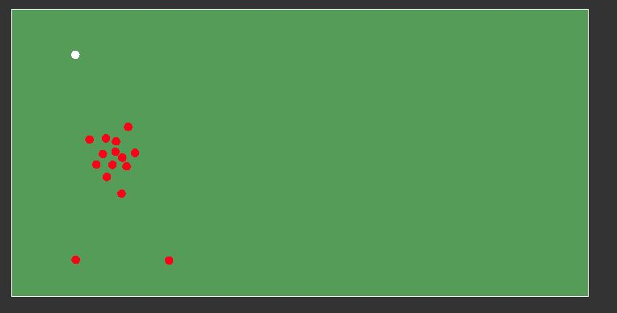

# 2D Collision Engine
Student project made at Newcastle University for Gaming Simulation Courses.

# Features
Represent a small pool with red marbles. You can interact to move the white marble to the left to make it collide with other marbles. This programm detect in real-time all collisions, and apply an impulsion on each marble collided.

